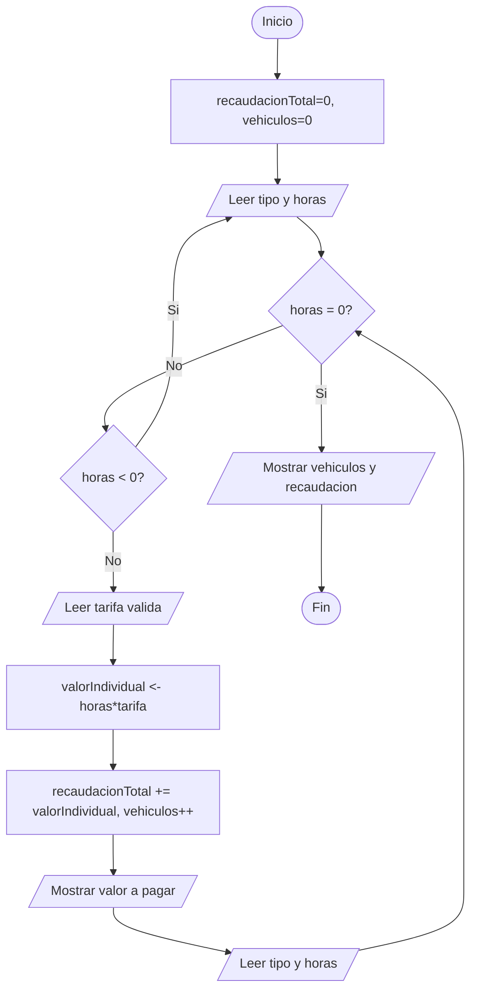

# Ejercicio 8. Estacionamiento universitario

Betancourt Steven 
Ogonaga Isaac
Terán Julio 

## Problema
Registre varios vehículos indicando tipo, número de horas y tarifa correspondiente. Calcule el valor individual y la recaudación total. El proceso finalizará al ingresar una opción centinela definida por el equipo.

## Análisis
No se conoce de antemano cuántos vehículos serán registrados, por lo que se necesita un ciclo controlado por centinela (`while`), que continúa mientras el valor ingresado en "número de horas" sea distinto del centinela (0). Para cada vehículo válido se solicita también su tarifa por hora, se calcula el valor individual (horas × tarifa) y se acumula en la recaudación total, mientras un contador registra el número de vehículos atendidos. Se valida que las horas y la tarifa no sean negativas.

## Entradas / Procesos / Salidas
- **Entradas:** tipo de vehículo, número de horas (0 = centinela para terminar), tarifa por hora.
- **Procesos:** validación de horas y tarifa no negativas; cálculo del valor individual; acumulación de la recaudación total; conteo de vehículos.
- **Salidas:** valor a pagar por cada vehículo, número de vehículos registrados, recaudación total.

## Algoritmo
1. Inicio.
2. Inicializar recaudacionTotal = 0, vehiculos = 0.
3. Solicitar tipo de vehículo y número de horas.
4. Mientras horas ≠ 0:
   1. Si horas < 0, volver a solicitarlas.
   2. Solicitar tarifa por hora. Mientras sea negativa, volver a solicitarla.
   3. Calcular valorIndividual = horas * tarifa.
   4. Sumar valorIndividual a recaudacionTotal; incrementar vehiculos.
   5. Mostrar el valor a pagar.
   6. Solicitar el siguiente tipo de vehículo y número de horas.
5. Mostrar vehiculos y recaudacionTotal.
6. Fin.

## Pseudocódigo (PSeInt)
```pseint
Algoritmo EstacionamientoUniversitario
    Definir tipo Como Cadena
    Definir horas, vehiculos Como Entero
    Definir tarifa, valorIndividual, recaudacionTotal Como Real

    recaudacionTotal <- 0
    vehiculos <- 0

    Escribir "Tipo de vehiculo:"
    Leer tipo
    Escribir "Numero de horas (0 para finalizar):"
    Leer horas

    Mientras horas <> 0 Hacer
        Mientras horas < 0 Hacer
            Escribir "Las horas no pueden ser negativas. Ingrese nuevamente:"
            Leer horas
        FinMientras

        Escribir "Tarifa por hora:"
        Leer tarifa
        Mientras tarifa < 0 Hacer
            Escribir "La tarifa no puede ser negativa. Ingrese nuevamente:"
            Leer tarifa
        FinMientras

        valorIndividual <- horas * tarifa
        recaudacionTotal <- recaudacionTotal + valorIndividual
        vehiculos <- vehiculos + 1

        Escribir "Valor a pagar: ", valorIndividual

        Escribir "Tipo de vehiculo (0 en horas para finalizar):"
        Leer tipo
        Escribir "Numero de horas:"
        Leer horas
    FinMientras

    Escribir "Vehiculos registrados: ", vehiculos
    Escribir "Recaudacion total: ", recaudacionTotal
FinAlgoritmo
```

## Diagrama de flujo


## Prueba de escritorio
Vehículo 1: Auto, 3 horas, tarifa 1.0 → valor 3.0. Vehículo 2: Moto, 2 horas, tarifa 0.5 → valor 1.0. Vehículo 3: horas = 0 (centinela) → fin.

| Vehículo | Tipo | Horas | Tarifa | Valor individual | Recaudación acumulada |
|----------|------|-------|--------|--------------------|--------------------------|
| 1 | Auto | 3 | 1.0 | 3.0 | 3.0 |
| 2 | Moto | 2 | 0.5 | 1.0 | 4.0 |

Resultado final: vehículos = 2, recaudación total = 4.0.

## Casos de prueba
| # | Vehículos registrados | Resultado esperado |
|---|--------------------------|---------------------|
| 1 | Auto(3h,1.0), Moto(2h,0.5), luego 0 | vehiculos=2, recaudacion=4.0 |
| 2 | Directamente 0 horas | vehiculos=0, recaudacion=0.0 |
| 3 | Camioneta(-2h → rechazado → 4h, 2.0) | Rechaza -2; valor=8.0 |
| 4 | Auto(5h, tarifa -1 → rechazada → 1.5) | Rechaza tarifa negativa; valor=7.5 |

## Evidencias

