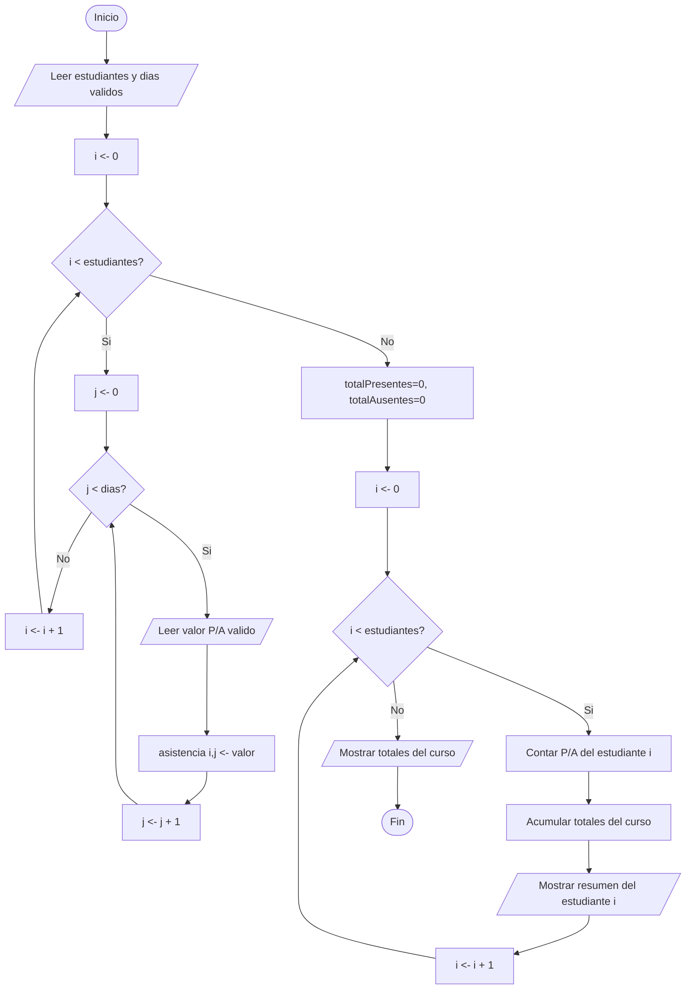

# Ejercicio 9. Matriz lógica de asistencia

- Betancourt Steven 
- Ogonaga Isaac
- Terán Julio 

## Problema
Solicite el número de estudiantes y el número de días. Para cada estudiante registre su asistencia mediante P (presente) o A (ausente). Al finalizar muestre las asistencias y ausencias de cada estudiante y los totales del curso.

## Análisis
Este problema requiere almacenar un valor por cada combinación de estudiante y día, lo cual corresponde naturalmente a una matriz (arreglo bidimensional). Para llenarla se necesita un ciclo externo que recorra cada estudiante y, dentro de él, un ciclo interno que recorra cada día de ese estudiante; de ahí la necesidad de `for` anidados. Cada valor ingresado se valida para que sea 'P' o 'A'. Al finalizar el llenado, se recorre nuevamente la matriz (también con `for` anidados) para contar, por cada estudiante, sus presencias y ausencias, acumulando además los totales del curso completo.

## Entradas / Procesos / Salidas
- **Entradas:** número de estudiantes, número de días, asistencia (P/A) de cada estudiante en cada día.
- **Procesos:** validación de estudiantes y días (> 0); validación de cada valor de asistencia (P o A); conteo de presentes/ausentes por estudiante y acumulación de los totales del curso.
- **Salidas:** presentes y ausentes de cada estudiante; total de presentes y ausentes del curso.

## Algoritmo
1. Inicio.
2. Solicitar estudiantes. Mientras ≤ 0, volver a solicitarlo.
3. Solicitar dias. Mientras ≤ 0, volver a solicitarlo.
4. Para i desde 0 hasta estudiantes-1:
   1. Para j desde 0 hasta dias-1:
      1. Solicitar asistencia (P/A). Validar que sea P o A.
      2. Guardar en la matriz[i][j].
5. Inicializar totalPresentesCurso = 0, totalAusentesCurso = 0.
6. Para i desde 0 hasta estudiantes-1:
   1. Inicializar presentesEstudiante = 0, ausentesEstudiante = 0.
   2. Para j desde 0 hasta dias-1:
      1. Si matriz[i][j] = 'P', incrementar presentesEstudiante; si no, incrementar ausentesEstudiante.
   3. Sumar al total del curso.
   4. Mostrar presentesEstudiante y ausentesEstudiante del estudiante i.
7. Mostrar totalPresentesCurso y totalAusentesCurso.
8. Fin.

## Pseudocódigo (PSeInt)
```pseint
Algoritmo MatrizLogicaDeAsistencia
    Definir estudiantes, dias, i, j Como Entero
    Definir presentesEstudiante, ausentesEstudiante Como Entero
    Definir totalPresentesCurso, totalAusentesCurso Como Entero
    Definir valor Como Caracter
    Dimension asistencia[50,50] Como Caracter

    Escribir "Numero de estudiantes:"
    Leer estudiantes
    Mientras estudiantes <= 0 Hacer
        Escribir "Valor invalido. Ingrese nuevamente:"
        Leer estudiantes
    FinMientras

    Escribir "Numero de dias:"
    Leer dias
    Mientras dias <= 0 Hacer
        Escribir "Valor invalido. Ingrese nuevamente:"
        Leer dias
    FinMientras

    Para i <- 0 Hasta estudiantes - 1 Con Paso 1 Hacer
        Para j <- 0 Hasta dias - 1 Con Paso 1 Hacer
            Escribir "Estudiante ", i + 1, " - Dia ", j + 1, " (P/A):"
            Leer valor
            Mientras valor <> "P" Y valor <> "A" Hacer
                Escribir "Valor invalido. Ingrese P o A:"
                Leer valor
            FinMientras
            asistencia[i,j] <- valor
        FinPara
    FinPara

    totalPresentesCurso <- 0
    totalAusentesCurso <- 0

    Para i <- 0 Hasta estudiantes - 1 Con Paso 1 Hacer
        presentesEstudiante <- 0
        ausentesEstudiante <- 0
        Para j <- 0 Hasta dias - 1 Con Paso 1 Hacer
            Si asistencia[i,j] = "P" Entonces
                presentesEstudiante <- presentesEstudiante + 1
            SiNo
                ausentesEstudiante <- ausentesEstudiante + 1
            FinSi
        FinPara
        totalPresentesCurso <- totalPresentesCurso + presentesEstudiante
        totalAusentesCurso <- totalAusentesCurso + ausentesEstudiante
        Escribir "Estudiante ", i + 1, ": Presentes=", presentesEstudiante, " Ausentes=", ausentesEstudiante
    FinPara

    Escribir "Total presentes curso: ", totalPresentesCurso
    Escribir "Total ausentes curso: ", totalAusentesCurso
FinAlgoritmo
```

## Diagrama de flujo


## Prueba de escritorio
Entrada: 2 estudiantes, 3 días.
Estudiante 1: P, P, A. Estudiante 2: A, P, P.

| Estudiante | Día 1 | Día 2 | Día 3 | Presentes | Ausentes |
|------------|-------|-------|-------|-----------|-----------|
| 1 | P | P | A | 2 | 1 |
| 2 | A | P | P | 2 | 1 |

Resultado final: total presentes curso = 4, total ausentes curso = 2.

## Casos de prueba
| # | Estudiantes | Días | Asistencia | Resultado esperado |
|---|--------------|------|------------|----------------------|
| 1 | 2 | 3 | E1:P,P,A / E2:A,P,P | Totales: presentes=4, ausentes=2 |
| 2 | 1 | 1 | P | Presentes=1, ausentes=0 |
| 3 | 3 | 2 | Todos "A" | Totales: presentes=0, ausentes=6 |
| 4 | -1 → (rechazado) → 2 | 2 | P,P / A,A | Rechaza -1; totales: presentes=2, ausentes=2 |

## Evidencias

