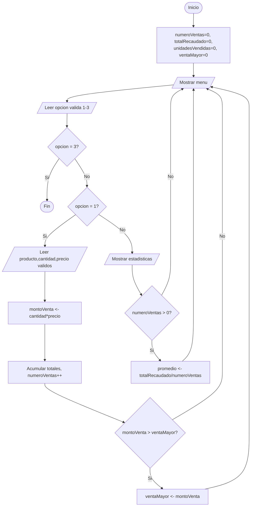

# Ejercicio 10. Sistema integrado de ventas

- Betancourt Steven
- Ogonaga Isaac
- Terán Julio 

## Problema
Desarrolle un sistema con menú: 1) Registrar venta, 2) Mostrar estadísticas y 3) Salir. Cada venta debe solicitar producto, cantidad y precio. Las estadísticas mostrarán número de ventas, unidades vendidas, total recaudado, venta mayor y promedio por venta.

## Análisis
Este ejercicio integra varios conceptos vistos en los anteriores: un menú que se repite con `do-while` hasta elegir "Salir", validaciones de cantidad (> 0) y precio (≥ 0) mediante `while`, y acumuladores para el total recaudado y las unidades vendidas. Cada venta registrada se guarda en arreglos para poder calcular después la venta mayor y el promedio por venta, y un contador registra el número total de ventas. Las estadísticas se calculan bajo demanda (cuando el usuario elige la opción 2), reutilizando los acumuladores ya actualizados en cada registro de venta, sin necesidad de recorrer todo el historial cada vez.

## Entradas / Procesos / Salidas
- **Entradas:** opción del menú (1-3); producto, cantidad y precio (para cada venta).
- **Procesos:** validación de la opción, la cantidad y el precio; cálculo del monto de cada venta; acumulación del total recaudado y de las unidades vendidas; conteo de ventas; actualización de la venta mayor.
- **Salidas:** confirmación de cada venta registrada; número de ventas, unidades vendidas, total recaudado, venta mayor y promedio por venta.

## Algoritmo
1. Inicio.
2. Inicializar numeroVentas = 0, totalRecaudado = 0, unidadesVendidas = 0, ventaMayor = 0.
3. Repetir:
   1. Mostrar el menú.
   2. Solicitar la opción. Validar que esté entre 1 y 3.
   3. Si opción = 1 (Registrar venta):
      1. Solicitar producto, cantidad (> 0) y precio (≥ 0).
      2. Calcular montoVenta = cantidad * precio.
      3. Acumular totalRecaudado y unidadesVendidas; incrementar numeroVentas.
      4. Actualizar ventaMayor si corresponde.
   4. Si opción = 2 (Mostrar estadísticas):
      1. Mostrar numeroVentas, unidadesVendidas, totalRecaudado, ventaMayor.
      2. Si numeroVentas > 0, calcular y mostrar promedio = totalRecaudado / numeroVentas.
   5. Si opción = 3 (Salir), terminar.
4. Hasta que la opción sea 3.
5. Fin.

## Pseudocódigo (PSeInt)
```pseint
Algoritmo SistemaIntegradoDeVentas
    Definir opcion, cantidad, numeroVentas Como Entero
    Definir producto Como Cadena
    Definir precio, montoVenta, totalRecaudado, ventaMayor, promedio Como Real
    Definir unidadesVendidas Como Entero

    numeroVentas <- 0
    totalRecaudado <- 0
    unidadesVendidas <- 0
    ventaMayor <- 0

    Repetir
        Escribir "1) Registrar venta"
        Escribir "2) Mostrar estadisticas"
        Escribir "3) Salir"
        Leer opcion

        Mientras opcion < 1 O opcion > 3 Hacer
            Escribir "Opcion invalida. Seleccione una opcion (1-3):"
            Leer opcion
        FinMientras

        Segun opcion Hacer
            1:
                Escribir "Producto:"
                Leer producto
                Escribir "Cantidad:"
                Leer cantidad
                Mientras cantidad <= 0 Hacer
                    Escribir "La cantidad debe ser mayor que cero. Ingrese nuevamente:"
                    Leer cantidad
                FinMientras
                Escribir "Precio unitario:"
                Leer precio
                Mientras precio < 0 Hacer
                    Escribir "El precio no puede ser negativo. Ingrese nuevamente:"
                    Leer precio
                FinMientras

                montoVenta <- cantidad * precio
                totalRecaudado <- totalRecaudado + montoVenta
                unidadesVendidas <- unidadesVendidas + cantidad
                numeroVentas <- numeroVentas + 1

                Si montoVenta > ventaMayor Entonces
                    ventaMayor <- montoVenta
                FinSi

                Escribir "Venta registrada. Subtotal: ", montoVenta

            2:
                Escribir "Numero de ventas: ", numeroVentas
                Escribir "Unidades vendidas: ", unidadesVendidas
                Escribir "Total recaudado: ", totalRecaudado
                Escribir "Venta mayor: ", ventaMayor

                Si numeroVentas > 0 Entonces
                    promedio <- totalRecaudado / numeroVentas
                    Escribir "Promedio por venta: ", promedio
                SiNo
                    Escribir "Aun no se han registrado ventas."
                FinSi

            3:
                Escribir "Saliendo del sistema de ventas..."
        FinSegun

    Hasta Que opcion = 3
FinAlgoritmo
```

## Diagrama de flujo


## Prueba de escritorio
Venta 1: Cuaderno, 3, 1.5 → 4.5. Venta 2: Lápiz, 10, 0.3 → 3.0. Luego, mostrar estadísticas.

| Venta | Producto | Cantidad | Precio | Monto | Total acumulado | Venta mayor |
|-------|----------|----------|--------|-------|--------------------|--------------|
| 1 | Cuaderno | 3 | 1.5 | 4.5 | 4.5 | 4.5 |
| 2 | Lápiz | 10 | 0.3 | 3.0 | 7.5 | 4.5 |

Resultado final: numeroVentas = 2, unidadesVendidas = 13, totalRecaudado = 7.5, ventaMayor = 4.5, promedio = 3.75.


## Casos de prueba
| # | Ventas registradas | Resultado esperado |
|---|----------------------|---------------------|
| 1 | Cuaderno(3,1.5), Lápiz(10,0.3) | ventas=2, total=7.5, promedio=3.75, mayor=4.5 |
| 2 | Ninguna, ir directo a "Mostrar estadísticas" | "Aun no se han registrado ventas." |
| 3 | Libro(0 → rechazada → 2, 20.0) | Rechaza cantidad 0; monto=40.0 |
| 4 | Goma(5,-1.0 → rechazado → 0.5) | Rechaza precio negativo; monto=2.5 |

## Evidencias

